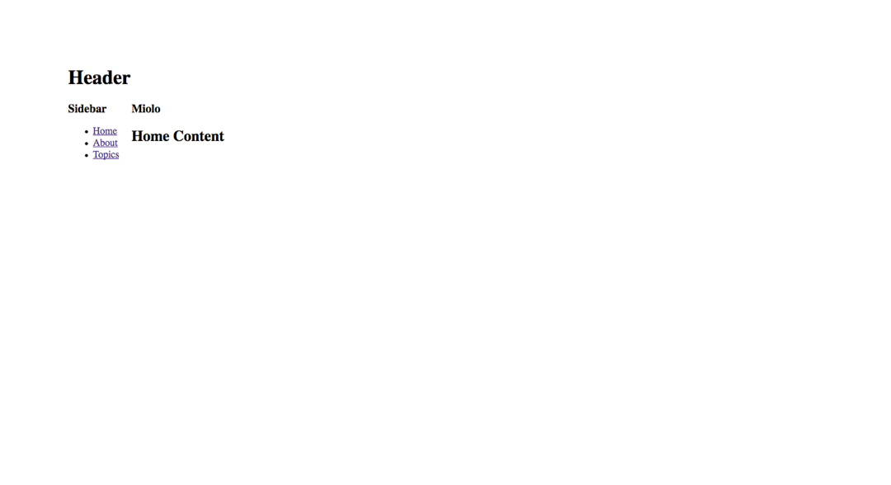
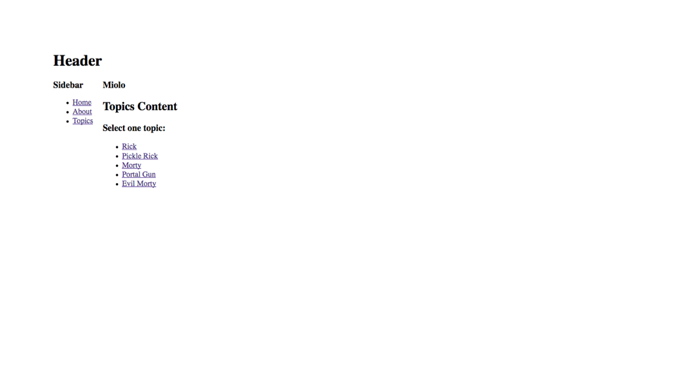
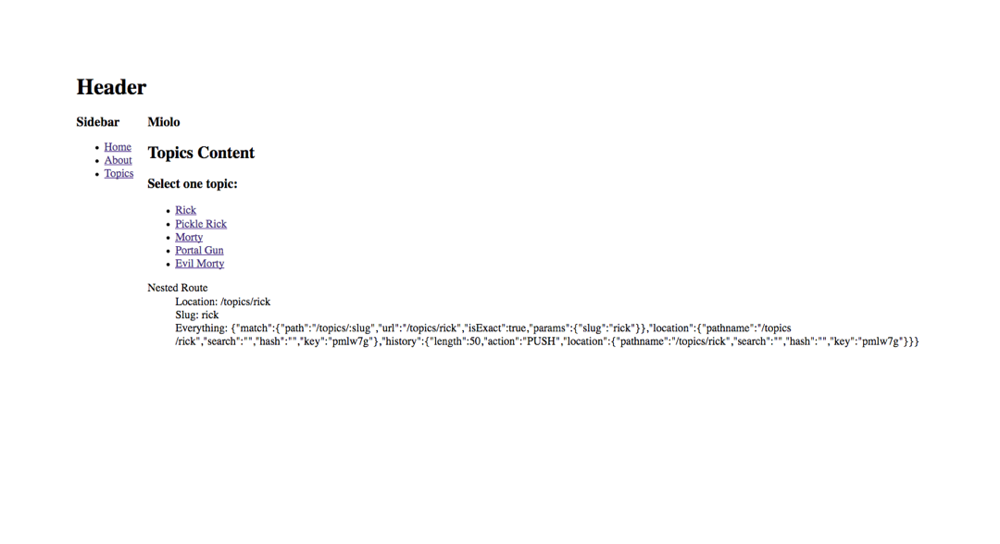
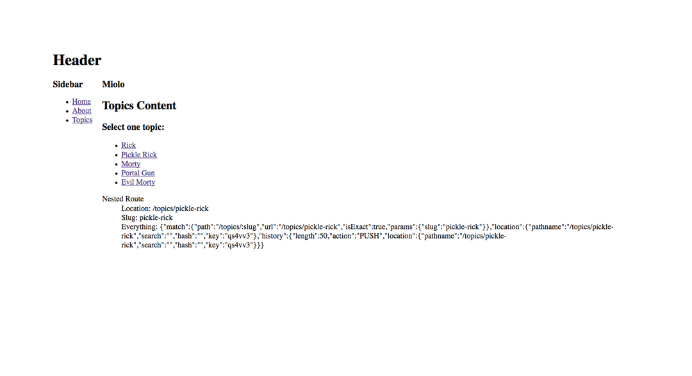

## Web Layout

Exemplo utilizando React Router V4 e colocando Rotas como componentes.

Nesse exemplo, temos 2 tipos de rotas:

* Rotas de Primeiro Nível
* Rotas Aninhadas

### Rotas de Primeiro Nível

Tradicionalmente, nós temos um _sidebar_ com alguns links onde apenas o conteúdo
é trocado ao clicar nos links, é isso que iremos chamar de "primeiro nível",
onde apenas esse "miolo" de conteúdo é substituido.

  

Utilizando o exemplo acima, ao clicar em "Home", "About" ou "Topics", o conteúdo
**abaixo** do título "Miolo" irá ser trocado pela página esperada.

No final, teremos as seguintes URLs:

* "http://localhost"
* "http://localhost/about"
* "http://localhost/topics"

### Rotas Aninhadas

Como o nome já diz, é uma rota aninhada em outra rota. Ou seja, algo como
"/topics/meu-topico". No último screenshot acima, temos a opção de clicar em um
tópico, resultando em:

 

Com isso, você pode renderizar o componente que desejar, alcançando as seguintes
URLs:

* "http://localhost/topics/rick"
* "http://localhost/topics/pickle-rick"
* "http://localhost/topics/morty"
* "http://localhost/topics/<QUALQUER_SLUG_QUE_VOCE_DESEJAR>"

---
